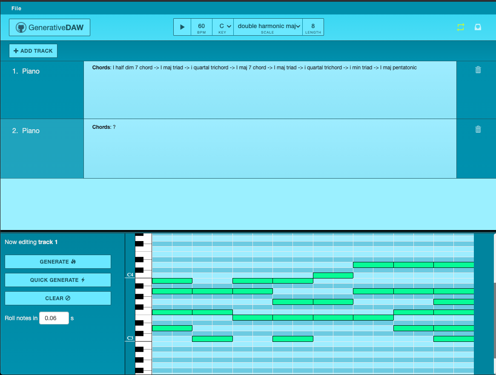

# GenerativeDAW

GenerativeDAW is a digital audio workstation webapp with tools for automated and generative MIDI composition. 

Built with Flask, Angular 8, and Python 3. Tested with Jasmine.

## Overview
This app is an assistive composition tool for music creators.

It applies algorithmic composition processes suggested by classical and jazz lineages to generate musically sensible compositions. Generated compositions can be downloaded as MIDI files and loaded into a conventional DAW like Logic Pro X or FL for sound designing and songwriting.

#### Music generation features:
- Use the classical chord leading system to generate chord progressions
- Configurably incorporate tasteful voicings from the built-in chord voicings library
- Specify the contour shape of a generated chord progression's topline (static, downward, up and then down...)
- Configurably incorporate popular chord-root movements into compositions
- Configure probabilities for the inclusion of non-diatonic, borrowed, altered dominant chords
- Logging panel in UI provides step-by-step explanations of the result generation method

#### General features:
- Add tracks and edit notes in a resizable piano roll window
- Export application state to a MIDI file and optionally download its generation log
- Import user-provided MIDI files for automated manipulation
- Quickly generate compositions with the Quick Generate button that reruns the last-applied settings and clicks play
- Chords can be rolled bottom-up during playback with a configurable note roll offset
- UI automatically calculates and labels chords with their names and scale degrees
- Cycle mode toggle button for looped playback


 
---


## Installation

#### To build and run the application:
Install Python 3, <a href='https://angular.io/guide/quickstart'>Angular</a>, and <a href="http://flask.pocoo.org/docs/1.0/installation/" target="_blank">Flask</a>. Clone the repo:
```
git clone https://github.com/ZakirG/generative-daw.git
```

In one terminal window, install dependencies and run the server application:
```
cd generative-daw/ServerApp
pip install -r requirements.txt
export FLASK_ENV=development
flask run
```

In another terminal window, install dependencies and run the client application:
```
cd generative-daw/ClientApp
npm install
ng serve --open
```
A tab will automatically open in your default web browser at localhost:4200. 

#### Overview of technologies used:
- The client-side audio-manipulation application is an Angular app that uses the WebAudio API
- The server-side generative-composition tools are Python 3 in a Flask framework
- The frontend layout makes use of Bootstrap 4, glyphicons from Bootstrap 3, and CSS3
- Client-side tests use the Jasmine framework and Karma test runner


#### Resources:
- Credit to <a href='https://github.com/g200kg/webaudio-pianoroll'>g200kg</a> for their WebAudio Piano Roll package. Their code has been integrated into this application and adjusted to match our needs.
- Credit to <a href='https://ankursethi.in/2016/01/13/build-a-sampler-with-angular-2-webaudio-and-webmidi-lesson-1-introduction-to-the-webaudio-api/'>Ankur Sethi</a>
for their examples on audio manipulation in Angular. Code snippets of theirs are used in this application.

This project's interface is based on Logic Pro X.

---
An example output of the application taken from the the logging panel in the UI:
```
Generating new chord progression in C major.
Decided to incorporate I, vi, IV, V. (The 50s progression)
Added C sus2 ( I ). Generation pathway: 
	- Using I to satisfy the I, vi, IV, V.
	- Chose to voice I as a sus2 from 30 applicable voicings.
Added A min triad ( vi ). Generation pathway: 
	- Using vi to satisfy the I, vi, IV, V.
	- Built vi by picking chord tones at random.
Added F major second inversion ( IV ). Generation pathway: 
	- Using IV to satisfy the I, vi, IV, V.
	- Chose to voice IV as a major second inversion from 2 applicable voicings.
Added G major second inversion ( V ). Generation pathway: 
	- Using V to satisfy the I, vi, IV, V.
	- Chose to voice V as a major second inversion from 1 applicable voicings.
I, vi, IV, V progression complete.
Added C add 9 ( I ). Generation pathway: 
	- Used major chord leading chart suggestion V -> I. 
	- Chose to voice I as a add 9 from 10 applicable voicings.
Added A sus4 ( vi ). Generation pathway: 
	- Picked scale degree vi randomly.
	- Chose to voice vi as a sus4 from 4 applicable voicings.
Added C whole tone trichord ( i ). Generation pathway: 
	- Used major chord leading chart suggestion vi -> I. 
	- Built I by picking chord tones at random.
Added A minor 7/11 (close voicing) ( vi ). Generation pathway: 
	- Picked scale degree vi randomly.
	- Chose to voice vi as a minor 7/11 (close voicing) from 7 applicable voicings.
~~~
Generation settings: 
	key: C
	scale: maj
	octaveLowerBound: 3
	octaveUpperBound: 4
	generationType: chords
	disallowRepeats: True
	toplineContour: {'name': 'no preference', 'code': 'any'}
	chordSizeLowerBound: 3
	chordSizeUpperBound: 7
	chanceToUseCommonVoicing: 0.95
	chanceToAllowNonDiatonicChord: 0.001
	chanceToAllowAlteredDominantChord: 0.7
	chanceToAllowBorrowedChord: 0.001
	chanceToUseChordLeadingChart: 0.7
	chanceToUseCommonProgression: 0.3
	maxToplineDistance: 3
	length: 8
```
