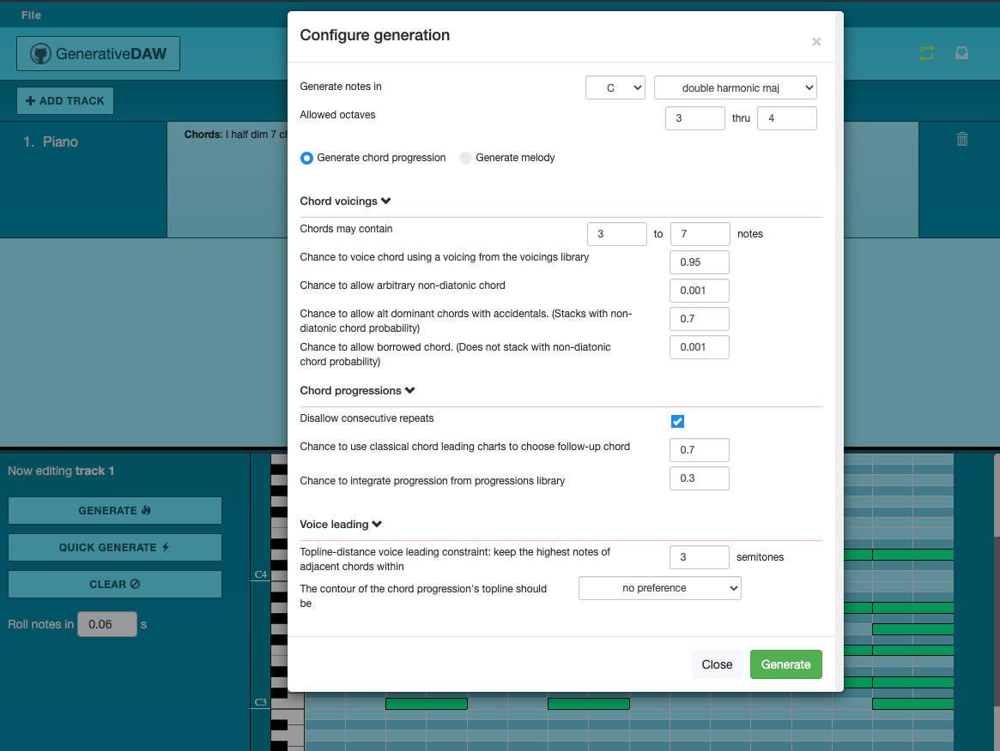

# GenerativeDAW

### A Digital Audio Workstation webapp focused on generative music composition. 

#### Built with Flask, Angular 6, and Python 3. Tested with Jasmine.

This project is a <a href='https://en.wikipedia.org/wiki/Digital_audio_workstation'>digital audio workstation (DAW)</a> webapp that provides a suite of tools
for <a href='https://en.wikipedia.org/wiki/Generative_music' target='_blank'>generative music composition</a>, in which the software system itself will compose the music.

The primary use case of the application (still in progress): The user specifies the generative settings they are interested in, 
which the software system responds to by composing a piece of music. The user then
edits the result to their taste, downloads the MIDI files, and continues work on the composition in their usual music creation
domain of choice (an instrument, sheet music, or a more high-powered DAW).

Project started 8/21/2018.

 




#### To build and run the application:
Install Python 3, <a href='https://angular.io/guide/quickstart'>Angular</a>, and <a href="http://flask.pocoo.org/docs/1.0/installation/" target="_blank">Flask</a> and then run
```
git clone https://github.com/ZakirG/generative-daw.git
```

In one terminal window, install dependencies and run the server application:
```
cd generative-daw/ServerApp
pip install -r requirements.txt
export FLASK_APP=main.py
export FLASK_ENV=development
flask run
```

In another terminal window, install dependencies and run the client application:
```
cd generative-daw/ClientApp
npm install
ng serve --open
```
A tab will then open in your default web browser at localhost:4200. 

#### Current functionalities:
- Ability to generate & play back random melodies or chord progressions in a scale of your choice
- Ability to create new track components and edit notes in a resizable piano roll pane
- A control bar with tempo selection, play/pause buttons, scale & tonic selection

#### Overview of technologies used:
- The client-side audio-manipulation application is an Angular app that uses the WebAudio API
- The server-side generative-composition tools are Python 3 in a Flask framework
- The frontend layout makes use of Bootstrap 4, glyphicons from Bootstrap 3, and CSS3
- The client-side tests use the Jasmine framework and Karma test runner

#### Project goals for version 0.01:
- A responsive, mobile-friendly interface
- Chord generation informed by chord leading charts, diatonic chord groups, and voice leading principles
- Melody generation informed by stable/unstable tone analysis, structural tone/embellishment principles
- Rhythm generation informed by selections of culturally specific macro-rhythms (clave 3/2, clave 2/3, reggaeton bounce, trap rhythms, ...)
- Ability to download the state of all tracks in the application as a single multi-instrument MIDI file
- Unit tests for the Flask/Python backend
- Frontend tests with Jasmine & Karma

#### Project goals for a possible version 0.02:
- Draggable and resizable piano roll notes with http://interactjs.io/
- A lyric generator that responds to drawn melodies using an Hidden Markov Model
- Machine learning algorithms applied to a dataset of MIDI files from pop music


Credit to <a href='https://ankursethi.in/2016/01/13/build-a-sampler-with-angular-2-webaudio-and-webmidi-lesson-1-introduction-to-the-webaudio-api/'>Ankur Sethi</a>
for their examples on audio manipulation in Angular; code snippets of theirs are used in this application.

Parts of the interface are inspired by Logic Pro X.
